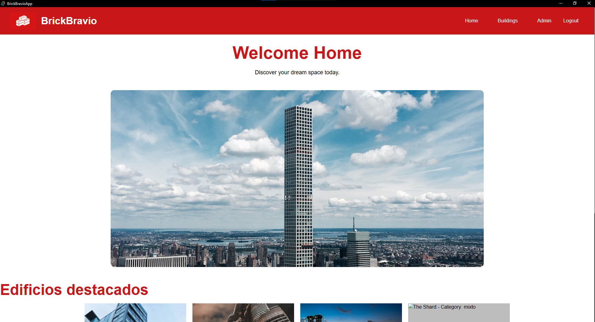
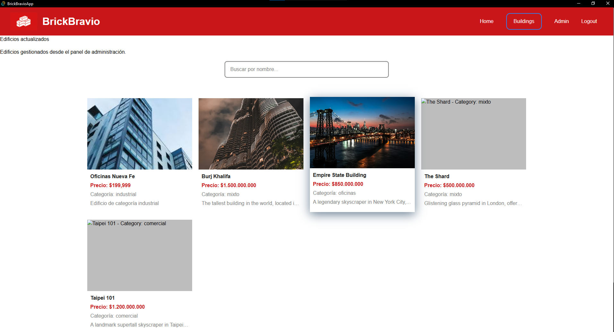
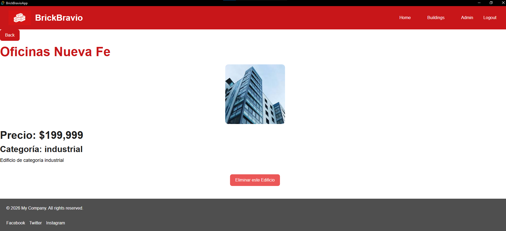
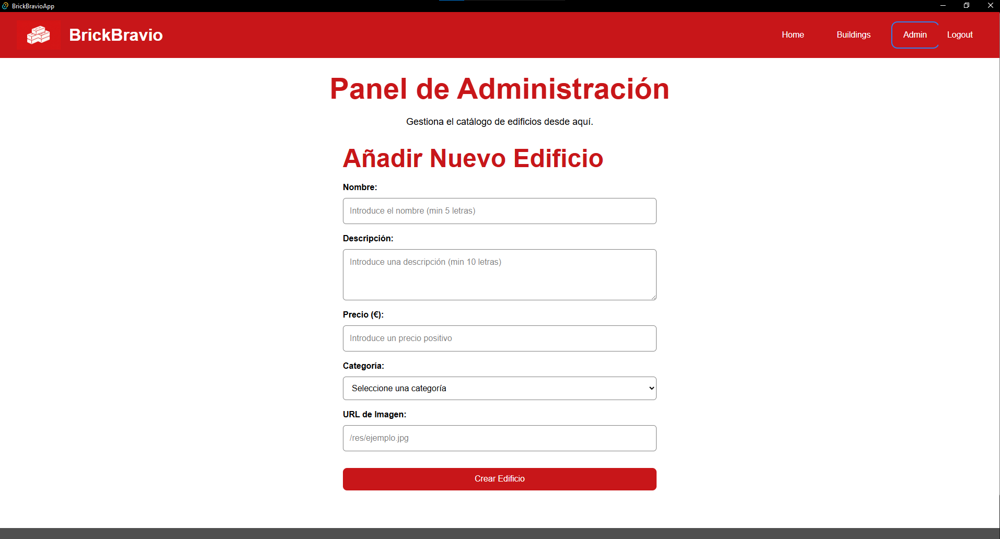
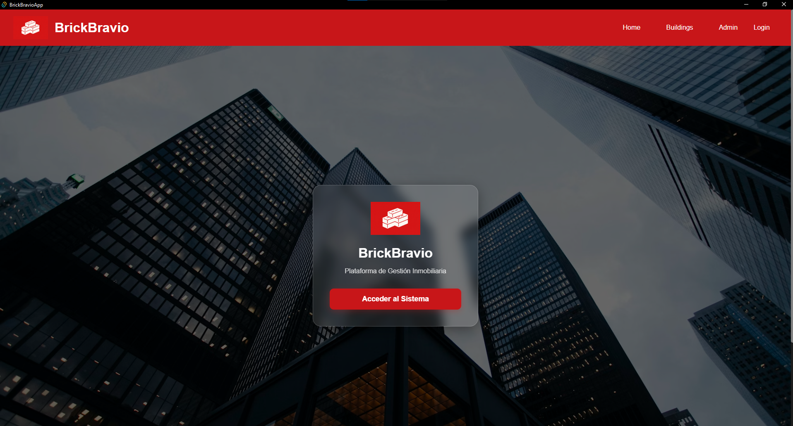

# Proyecto de Listado de Edificios

## Descripción

Esta aplicación es un **sitio web React** que muestra un listado de edificios con detalles individuales. Está diseñada para ser **accesible, responsiva y fácil de usar**, siguiendo buenas prácticas de desarrollo web moderno.

La aplicación incluye:

- Página de inicio (`HomePage`)  
- Listado de edificios (`BuildingPage`)  
- Página de detalle de cada edificio (`DetalleEdificios`)  
- Panel de administración (`AdminPage`)  
- Navegación principal (`Nav`) y pie de página (`Footer`)  
- Layout principal (`Content`) que organiza las rutas hijas mediante `<Outlet />`  

---

## Tecnologías utilizadas

- **React 18**  
- **React Router v6** para la gestión de rutas  
- **Tailwind CSS** para estilos y diseño responsivo  
- **CSS variables** para colores y tipografía  
- Estructura de componentes modular (Card, Edifice, Section, Footer, etc.)  

---

## Estructura del proyecto

```bash
src/
├─ components/
│ ├─ Card.jsx
│ ├─ Edifice.jsx
│ ├─ Nav.jsx
│ ├─ Footer.jsx
│ ├─ Section.jsx
│ └─ Content.jsx
├─ pages/
│ ├─ HomePage.jsx
│ ├─ AdminPage.jsx
│ ├─ BuildingPage.jsx
│ └─ DetalleEdificios.jsx
├─ data/
│ └─ edifices.js
├─ assets/
│ ├─ theme.css
│ └─ index.css
└─ App.jsx

```


---

## Características de la aplicación

### Navegación

- Barra de navegación fija con enlaces a Inicio, Edificios y Admin  
- Menú hamburguesa para dispositivos móviles  
- Enlaces accesibles con botones dentro de `<Link>` para garantizar interacción y estilos consistentes  

### Listado de edificios

- Cada edificio se muestra mediante el componente `Edifice` dentro de un `Card`  
- Información: nombre, foto, precio, categoría y descripción  
- Cada edificio es enlazable a su detalle individual  

### Página de detalle

- Muestra toda la información del edificio seleccionado  
- Botón “Volver” que regresa a la página anterior usando `useNavigate()`  
- Imagen con texto alternativo (`alt`) para accesibilidad  

### Footer

- Visible en todas las páginas  
- Muestra derechos reservados y enlaces a redes sociales  
- Fondo con color gris claro definido por variables CSS  

---

## Accesibilidad y Usabilidad

La aplicación incorpora varias **prácticas de accesibilidad (a11y)** y usabilidad:

1. **Landmarks semánticos**: `<main>`, `<header>`, `<footer>` correctamente utilizados  
2. **Navegación por teclado**: `tabIndex="0"` en elementos clave y botones dentro de `<Link>`  
3. **Texto alternativo**: Todas las imágenes incluyen `alt` descriptivos  
4. **Contraste y legibilidad**: Colores primarios y secundarios bien definidos con variables CSS  
5. **Responsividad**: Layout adaptativo con Tailwind; menú hamburguesa para móviles  
6. **Feedback visual**: Hover y transiciones suaves (`transition-colors`) en enlaces y botones  

### Pruebas de la aplicación en funcionamiento

- Inicio:



- Página de edificios:



- Página de detalle:



- Página de admin:



- Página de login:

